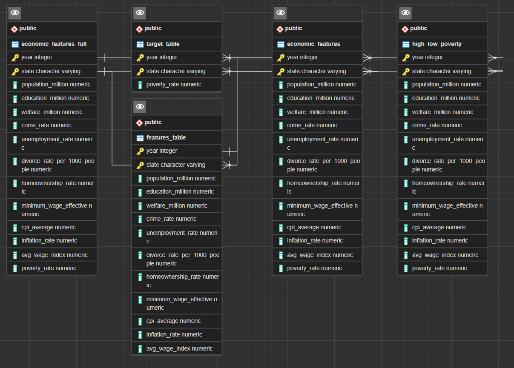
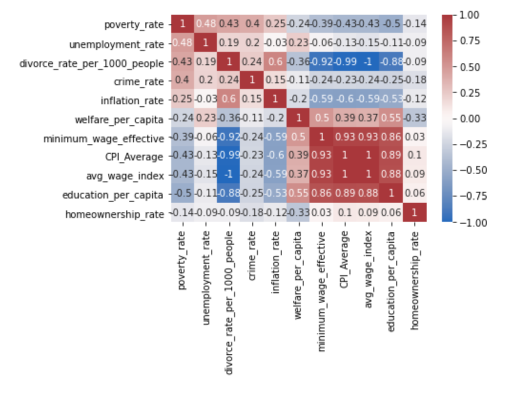
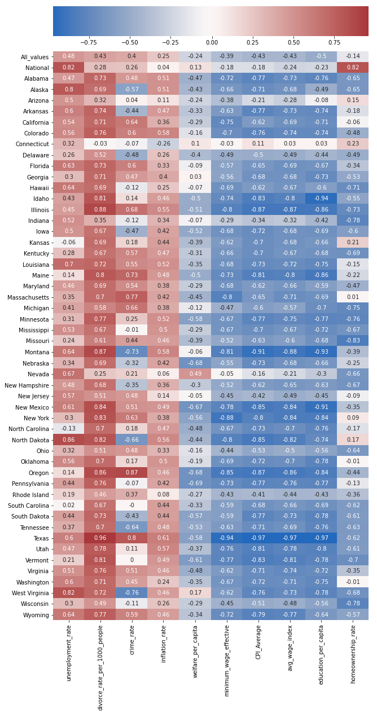

# Poverty and Minimum Wage

This project can be viewed at: https://predicting-poverty-rates.herokuapp.com/

## Topic

This project analyzes if and how major economic indicators: population, education spending, welfare spending, crime rate, unemployment rate, divorce rate, homeownership rate, effective minimum wage, average wage index, consumer price index (CPI), and inflation rate, can predict poverty rates in the United States on both the state and national level.

## Reasons for Selection

Looking at the economic situation of the US during and coming out of COVID, it is of interest to evaluate which economic indicators most affect poverty levels and if these economic indicators can be used to predict poverty rates.

## Data Sources

- Population & Education and Welfare Spending, usgovernmentspending.com <https://www.usgovernmentspending.com/download_multi_year>  
- Crime Rate, FBI Crime Data Explorer <https://crime-dataexplorer.app.cloud.gov/pages/explorer/crime/crime-trend>
- Unemployment Rate, Bureau of Labor Statistics <https://www.bls.gov/lau/>
- Divorce Rate, CDC, <https://www.cdc.gov/nchs/nvss/marriage-divorce.htm>
- Homeownership Rate FRED.gov (Federal Reserve Bank) <https://fred.stlouisfed.org/series/USHOWN> 
- Effective Minimum Wage Kaggle.com <https://www.kaggle.com/lislejoem/us-minimum-wage-by-state-from-1968-to-2017>
- Average Wage Index, Social Security Administration <https://www.ssa.gov/oact/cola/awiseries.html>
- Inflation and CPI, BLS, <https://inflationdata.com/Inflation/Inflation_Rate/HistoricalInflation.aspx>
- Poverty Rates, Center on Poverty and Social Policy at Columbia University <https://www.povertycenter.columbia.edu/state-fact-sheets>

## Research Questions

- Can poverty levels be inferred from historical economic indicators?
- Which economic indicator has the highest impact on poverty levels?
- How does adjusting certain economic indicators affect the poverty rate?

## Team Members

Ha Duong, Kyle Gee, Jose Orellana, Jeanette Perthel, and Taylor Takanishi

## Technologies Used

The following technologies will be used for this project:

- Jupyter Notebook, Python, and Pandas Library for data cleaning, joining, and organizing data for models and graphs
- AWS RDS and Postgres for the database and data storage
- SQLAlchemy for database connection
- Scikit-learn's LinearRegression and DecisionTreeRegressor for machine learning models
- GitHub pages, HTML, CSS, JavaScript, Flask for webpage deployment
- Heroku for application deployment

## Project Outline

- ETL: The data was extracted from sources such as CSVs, and read into Jupyter Notebook, transformed using Pandas and loaded into new CSVs `economic_features_full` and `economic_features` datasets. These datasets were exported and uploaded to GitHub along with the raw data files.
- Amazon RDS and a PostgreSQL database were used to store the data on the cloud so that the database can be accessed by all team members without needing to store it locally. A connection to the database was created using SQLAlchemy. 
- Using the SQLAlchemy connection, data is loaded into Jupyter Notebook for machine learning models. The models created were split, trained, tested and the trained models were saved using Python pickle module.
- Machine learning models were used to predict poverty levels
- A Flask application is used to display data visualizations a webpage. It includes Tableau, JavaScript, HTML, and CSS.

## Data Collection, Exploration, and Processing

The datasets chosen for this project were inspired by relevant literature and research on poverty in the United States, including articles from the US census, Bureau of Labor Statistics (BLS) and the U.S. Department of Health and Human Services. Data was collected from various reliable sources, specifically from government agencies such as Social Security Administration, US Census Bureau, CDC, BLS, Federal Reserve Bank (FRB), and the FBI. The intention of this project is to evaluate how major economic indicators (independent variables) affect poverty rates (target variable) on a national and state level. 

Data for each feature was collected individually on a state and national level.  A single CSV file was aggregated from data from each state for each feature. Some features were collected from multiple sources, because specific years for certain features needed to be found through various sources. Datasets for each state and feature were considered based on the range of years, data format provided by each source, and general availability.  

Data processing included eliminating null values, duplicates, identifying gaps, and verifying correspondence among the datasets. Data was evaluated for outliers to confirm datatypes were coherent. All features were merged into a single dataset which resulted in 14 columns and a little less than 3,000 rows.

Data exploration included investigating the relationship between independent variables with the dependent variable (poverty rate). Trends, patterns, and correlations were evaluated using various plotting techniques such as: box and whiskers, line plots, scatter, heat map of correlation matrixes, and best fit line. Additionally, statistics for the dataset was evaluated using ‘.describe’ and correlation functions. Each state was evaluated for a specific feature to identify possible complications in the data. State and national data was compared to find possible trends or patterns.

## Database

Amazons RDS for PostgreSQL is used to store the database. All of our data was combined into one dataset, which was imported into the `economic_features_full` table. This table was used to create two new tables, `features_table` and `target_table`. The `features_table` contains all the information for the features used in the machine learning model to target poverty rates. The `target_table` contained the `year`, `state`, and `poverty_rate` information used as a target for our machine learning model. These two tables were then joined into an `economic_features` table containing all the data, without any rows containing null values. Finally, a `high_low_poverty` table was created and populated using the data from the `economic_features` table. This table contains the data for each state for the year with the highest and lowest poverty rates.

Below is the ERD for the database.

## Machine Learning

### Overall Vision

Use machine learning to forecast poverty rate based on an user entered set of features (input values).

### Approach

We identified four machine models to experiment with and created templates for each - linear regression, ridge linear regression, deep learning and decision tree regressor models.

Linear regression and decision tree regressor were selected because we want to predict a continuous dependent variable with the help of independent variables.
Since the objective of this project is to model the relationship between various socio-economic factors and poverty rates,  and all the factors and poverty rate are continuous variable.

The independent variables, or features, included the following socio-economic measures for each state as well as the national level:

- population,
- education spending,
- welfare spending,
- crime rate,
- unemployment rate,
- divorce rate,
- homeownership rate,
- effective minimum wage,
- average wage index,
- consumer price index (CPI),
- and inflation rate.

The dependent variable (target) was the poverty rate.

Below is a heatmap of how each feature correlates to poverty rate.

### Additional Pre-Processing

During analysis of the data, it was discovered that education and welfare spending per capita had a better correlation to poverty rate than the total expenditure amount.  So, after loading the data, the features `education_spending_per_capital` and `welfare_spending_per_capita` were calculate and the total spending and population numbers dropped from the dataset.

### Model Choice & Benefits

We also evaluated and prototyped the regressions and deep learning models, ultimately selecting linear regression, linear ridge regression and decision tree regressor as the most applicable models to perform further analysis to meet the project objective for the following reasons:

- Linear regression demonstrates the numeric relationship between the dependent variable and independent variables and produces the "line of best fit" (or hyperplane as in the case with multi-variable models) that represents the dataset. It also indicates the significant relationships and strength of impact of the multiple independent variables on the dependent variable.
- Decision tree regressor model supports both classification and regression problems. Decision tree algorithms are particularly useful for complex datasets and has the added advantages of requiring less data cleaning, non-linearity does not affect the model's performance and the number of hyper-parameters to be tuned is minimal.

#### Multiple Linear Regression

We used two linear models from the scikit-learn library:  `LinearRegression` and `Ridge`. They both are ordinary least square regression models, however the Ridge Regression includes a penalty term on the weights of the loss function that reduces the standard error under certain conditions (multicollinearity).

For the linear regression model, we used the connection string to the database and loaded in the `economic_features_full` table into a dataframe. From here, the `education_million` and `welfare_million` columns were used to create `education_per_capita` and `welfare_per_capita` columns. 
The `population_million`, `education_million` and `welfare_million` columns were dropped. The features used are: `crime_rate`, `unemployment_rate`, `divorce_rate_per_1000_people`, `homeownership_rate`, `minimum_wage_effective`, `cpi_average`, `inflation_rate`, `avg_wage_index`, `education_per_capita`, `welfare_per_capita`, and the target variable is `poverty_rate`. 

A function was created to train a linear regression model for each state. Using scikit-learn's `train_test_split`, the data was split into a 90-10 train/test ratio then trained and tested. The predicted values were then plotted for each state on a line plot containing the actual values and predicted values, with the predicted values for the testing data clearly identified. 

Finally, a dataframe was created to display the coefficients, intercept, mean absolute error, mean squared error, model type, R2 score, R2 ridge score, and delta R2 for the models of each state.

It was determined that the `LinearRegression` model provided consistently higher r2 scores for more states than the `Ridge` model.  We focused on the `LinearRegression` model for the rest of the decision.

#### Decision Tree Regressor

After connecting to the database via SQLAlchemy, the dataset `economic_features` was loaded. The `state` and `year` columns were dropped, as they would not be used as features in the `DecisionTreeRegressor` model. The `population_million`, `education_million` and `welfare_million` columns were used to create the `education_per_capita` and `welfare_per_capita` columns, then dropped. A function was then created to train a `DecisionTreeRegressor` model for every state, and the r2_score was saved and added to the `state_scores` dataframe which showed the state name and the corresponding r2_score for that state's model.

Next, a `DecisionTreeRegressor` was used to create a model for the entire dataset, where the score was added to the `state_scores` as `"Entire"`, and the model was saved using Pickle. These models were trained and tested using `train_test_split()`, with a training size of 0.8. A function called `display_metrics` was created to take in a state name and output its R-Squared value and the models ranked feature importance. The `DecisionTreeRegressor` worked very well for most states, but very poorly for others. Dropping column(s) would increase the accuracy for some, while worsening the score for others and a few states would have very poor scores regardless of how the model was adjusted. 

### Model Training and storage

After in depth evaluation of both `LinearRegressor` and `DecissionTreeRegressor` models, the following decisions were reached:

- a single model to cover all states was not workable, instead a model per state would be created and used. Thus, the forecast of the `poverty_rate` would be state specific.
- `LinearRegressor` and `DecissionTreeRegressor` models were trained for each state using a 90:10 train-test split their R2 scores tallied  and reviewed. The split at this point ensured that new points were used for the R2 score calculation.
- The model with the highest R2 Score was used, retrained using all the available data points for the state and saved using `Pickle` for later use.

The below image shows how for each state the importance of each feature varies. 

### Accurary Score

Due to the nature of the poverty rate and its complex relationship with social and economic factors, it was expected that some states would have better scores than others.

In practice, 67% (34) of the models have an R2 score higher than 0.75, and 80% (41) of models show an R2 score higher than 0.60.some states had very good R2 scores.

A few models (7) have negative R2 scores.  This indicates that the model is unreliable and should be used with attention.

A decision was made to include all states in the forecasting interface and present the user with the R2 score together with the model type and the forecasted `poverty_rate` when using the tool.

Below is a snapshot of part of our model summary of each state's most accurate model and its R2 score. For the full model summary, please see `Machine_Learning/Model_summary.csv`

### Benefits

The benefits we observed of using a our approach were:

- provided a continuous variable output
- used continuous variables as inputs
- able to cross-check correlation values of the features to the target versus the coefficients produced by the model
- ensure that we had the best model that was tested for the state. 

### Limitations

- Some of the data sourced had gaps for some states for some early or late years.  This meant that the final dataset had to be reduced to the years where all features and target were available.
- Linear regression assumes that there is linearity between the dependent and independent variables which is not always reflected in the real world.
- We discovered that different states have different correlations between the poverty_rates and the feature variables.  This could be due to many factors including state regulations, differences in data gathering as well as the general socio-economic outlook of the state.
- The above point meant that models had to be created at the state level and that the number of rows (data points) were limited for each state.

To overcome some of these limitations, we took the following steps:

- We sourced additional data for the missing years and added it to the input data and re-ran our pipeline.
- We evaluated models used the model that had a better R2 score. Additionally, decided to present the user with the R2 score for the model when using it in the forecasting module.

### Recommendations For Future Improvements

For future analysis it is recommended that additional features be obtained and added to the model. For example, median wage was not easily obtained at the state level for the desired timeframe.

Increasing the granularity of some features, such as `divorce_rate` may also improve the model for certain states.

Additionally, a forecasting model can be created based on years where each feature can have a model that can predict the feature's value based on an input year and all of the feature's predictions for that year can be fed into the machine learning model to predict the poverty rate for that year.

## Analysis

Because of the nature of the data, it is difficult to look at all of the data together and understand the relationship. Each state has its own laws and regulations concerning most of the features, which was found to greatly impact the correlation between states, economic indicators, and poverty rate. The best way to look at our data is found in `Data_Preprocessing/Exploratory_Analysis/Exploratory_plotting_dataset.ipynb` and `Data_Preprocessing/Exploratory_Analysis/Exploratory_Data_Analysis_Initial.ipynb`. To compare the importance of the features, scatter plots were created with a line of best fit to clearly show correlation between a feature and state. Each state had a different "best" feature (the feature which was most closely related to poverty rate), which meant the machine learning model will need to be trained separately on each state individually so the most accurate prediction is made.

## Presentation and Visualization

The results of this project will be displayed in a webpage. The page will include the analysis of the results, interactive and static graphs, interactive tables, and an interactive poverty predictor. For the interactive graphs, the user will be able to select the state(s) and feature(s) they wish to see a historical line plot of. An example of the static graphs is a heatmap of a correlation matrix for the economic features, displaying how strong, or weak, of a relationship there is with each of the other features. For the poverty predictor, the user will pick a state, which will select the saved machine learning model for that state. They will then be able to adjust the values of the features, and these customized features will be fed into the trained machine learning model to predict the poverty rate for the users customized features.
For further detail, please see the presentation slides at: <https://docs.google.com/presentation/d/1NLt1smV6o_XQYnkSUbI9vALHA7O8xi9Xx7wRWB2JqQM/edit?usp=sharing>

## Dashboard

The dashboard has been storyboarded on Google Slides. Please see link for the storyboard. A PDF printout of the slides is also available in the Resources folder. <https://docs.google.com/presentation/d/1k4L55AXTQFh2Fi2KP3iuTtuOt3RAzvSBZ7cHQ-Q94Ok/edit?usp=sharing>
